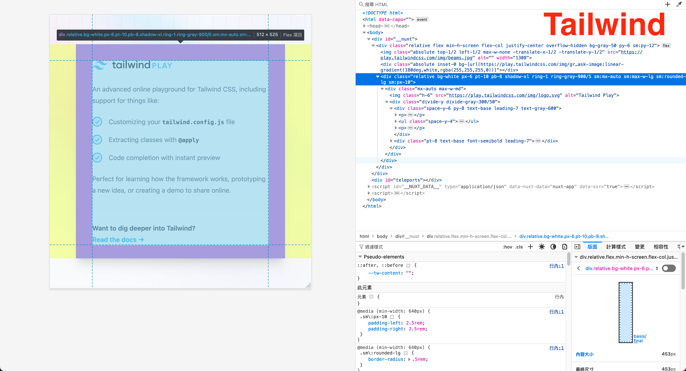
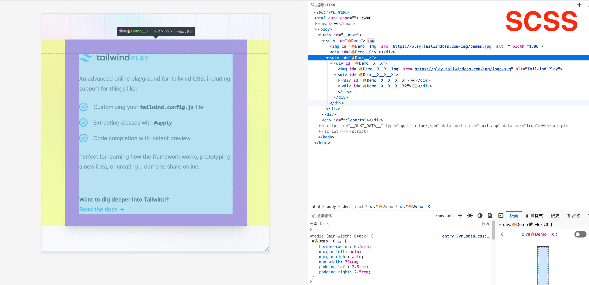

## 快速連結

- [什麼是 ESCSS](#什麼是-escss)
- [核心概念 - 本質複雜性](#核心概念---本質複雜性essential-complexity)
- [例子](#例子)
- [問與答](#問與答)

## 什麼是 ESCSS?

- ESCSS = extra structure (BEM) CSS + 致敬 ECMAScript
- ESCSS (發音如同 'escapes') 是一種銀彈方法論，靈感來自《人月神話》一書，旨在解決軟體困境，減少開發者的挫敗感。

## 核心概念 - 本質複雜性(essential complexity)

將相似的事物分組，提取共同元素，並不斷重複。


## 例子



| | HTML | CSS | 更新速度* | 相容性* |
| - | - | - | - | - |
| Tailwind | 11.01 kB| 8.79 kB | <0.3s | Yes |
| Sass | 8.59 kB| 5.73 kB | ~0.7s| Yes |

****手動測試的數據, MacBook Air 2020 | intel Core i3 | 8G***    
****從一方轉換、過渡到另一方的能力***

[專案](https://github.com/ESCSS-labs/demo)

## 問與答

### 為什麼你認為 ESCSS 是銀彈嗎？?

- CSS 和 JavaScript 自多年來年一直居於 Stack Overflow 的排行榜中的前三名，並且可以用於網站、應用程序和遊戲等不同用途。
- CSS 和 JavaScript 易於使用，但維護起來可能具有挑戰性。這就是 ESCSS 可以簡化和增強的部分。
- ESCSS 將物件導向與函數編成風格結合。

### JavaScript部分的演示

#### 可變性(Mutation):

- 可變性比不可變性操作更有效率.
- 使用 ESCSS-ESTest 來創建純函數.

### CSS部分的演示

#### ID:

- 保持 HTML 的簡潔。
- 通常維護扁平化的特異性(1,0,0)。
- 處理 Bootstrap 中的 !important 情況。

#### 狀態 Class:

- 使用 !important 覆蓋 id.

```scss
.--active {
  background: red !important;
}
```

#### 開發者體驗:

- 提高開發工具的可讀性。.
- 建議使用 example 2 以便於複製/搜索/替換。

```scss
// example 1
 #🔥PersonCard {
  // ...
  &__Img {
    // ...
  }
}

// example 2
 #🔥PersonCard {
  // ...
}
#🔥PersonCard__Img {
  // ...
}
```

#### 命名風格:

- PascalCase: 🔥CardVue (遵循組件名稱以保持一致性)。
- 雙下劃線 (__): 🔥CardVue__CardText。
- 狀態 class 的雙連字符 (--): --dark、--active。
- 使用表情符號以增強組織性/可讀性: 頁面元件 (🌀), 元件 (🔥)。
- 無意義元素: 遵循元素名稱 🔥Card__X__A、🔥PersonCard__Img。

***這是只是我最喜歡的風格，你可能有不同的偏好。***
