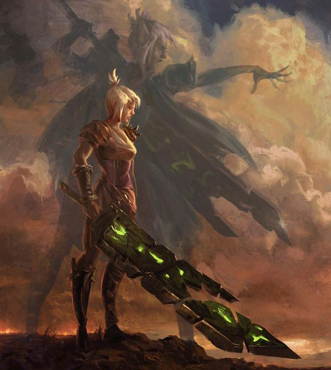
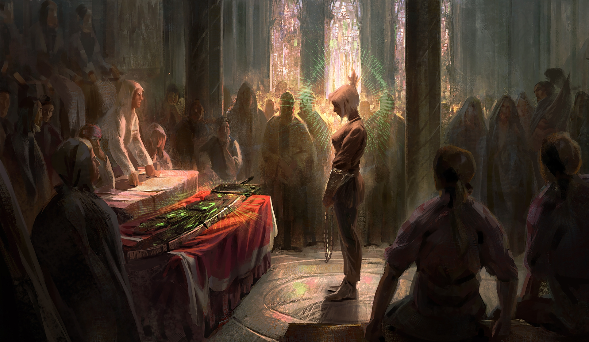
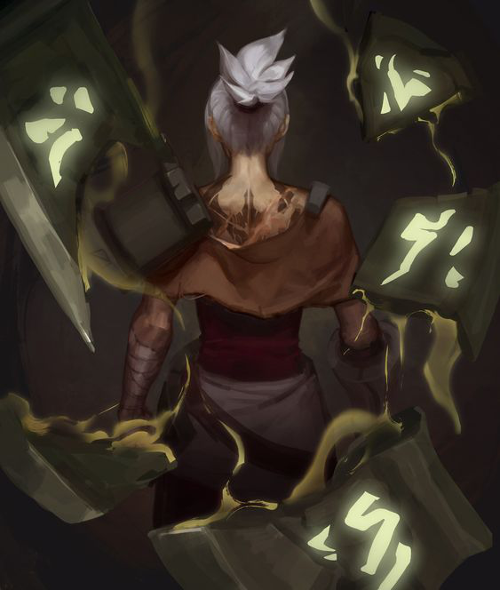
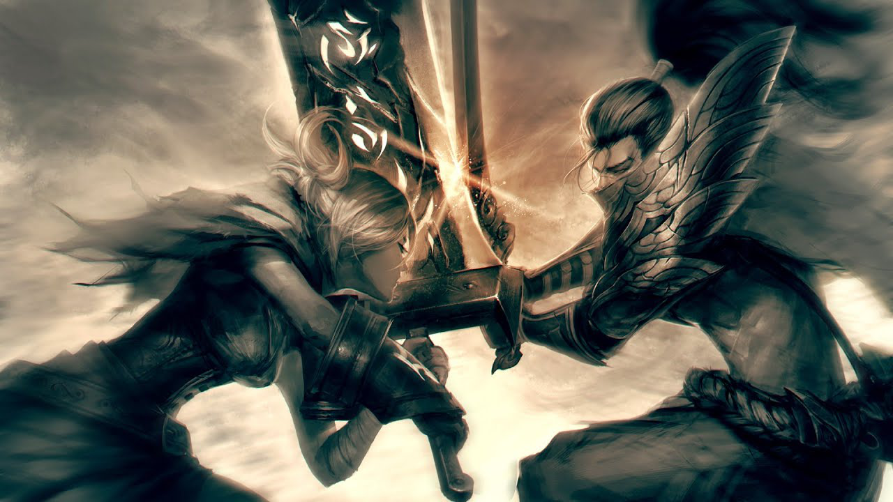

# ESCSS - "The Intersection of Wind and Destiny"

*Why have you drifted here, wanderer?*
*Your figure is shrouded in the silence of wailing.*

*For many years... the silver bullet people have been seeking, is it a dream? Or an illusion?*

*Awaken, awaken, break free from the shackles of the past.*

*Awaken, awaken, the silver bullet shining in the darkness.*

**"Which weighs more, Riven（CSS）? Your blade(BEM), or your past?"**

