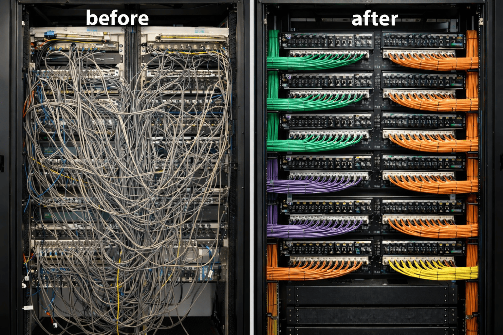

# What is ESCSS?

ESCSS (pronounced "escapes") is **the progressive methodology** based on [BEM](https://en.bem.info/) & [The Mythical Man-Month](https://en.wikipedia.org/wiki/The_Mythical_Man-Month)

## Why?
  - 🔥 Bring Clarity to HTML/CSS/JS Project
  - 💪 ID-Based E2E Simplicity
  - 🤝 Harmony with CSS, SCSS and Tailwind
  - 💣 Don't care about CSS specificity
  - ❤️ Clean CSS DevTools Experience
  - 🪶 Smaller CSS sizes
  - ⬇️ Clean HTML
  

## Emoji for Visualization (Optional)
  - (🏗️)LayoutComponent
  - (🏠)page-component -> `kebab-case` for URL-related page components.
  - (🔩)SharedComponent
  - (🧱)Component

## Naming Convention:

- PascalCase: 
  - 🧱CardList (see `CardList.vue`, `CardList.jsx`)

- Only `First` / `Last` word matters:
  - 🧱CardList__Title
  - 🧱CardList__X__Address
  - 🧱CardList__X__X__Name

- compressed with gzip:
  - `__X` <- repeated pattern

- What if ...?
  ```html
  <!-- Extract into a component  -->
  
  <!-- BEFORE -->
  <section id="🧱CardList">
      <div id="🧱CardList__X">
        <!-- other components -->
      </div>

      <div id="🧱CardList__X2">
          <div id="🧱CardItem__X2__X">
              <div id="🧱CardItem__X2__X__Name">
              <div id="🧱CardItem__X2__X__Price">
              <div id="🧱CardItem__X2__X__Content">
              <div id="🧱CardItem__X2__X__Amount">
      </div>
  </section>
  

  <!-- AFTER -->
  <section id="🧱CardList">
      <div id="🧱CardList__X">
        <!-- other components -->
      </div>

      <div id="🧱CardList__X2">
          <div id="🔩CardItem">
              <div id="🔩CardItem__Name">
              <div id="🔩CardItem__Price">
              <div id="🔩CardItem__Content">
              <div id="🔩CardItem__Amount">
      </div>
  </section>
  ```

## Status class:
```html
<!-- using tailwind -->
<p id="🧱CardList" class="!bg-red-500">Demo</p>
```

``` html
<!-- using CSS / SCSS -->
<p id="🧱CardList" class="--active">Demo</p>
```
``` scss
#🧱CardList {
  background: blue;
}

.--active {
  background: red !important;
}
```