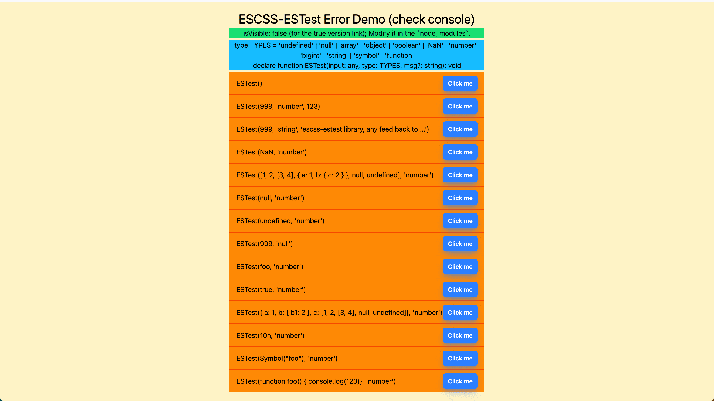
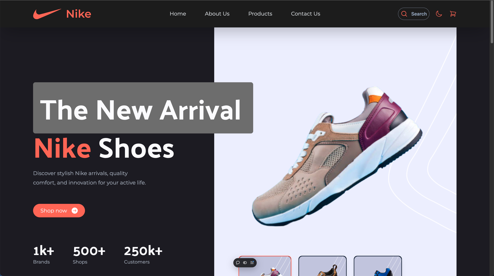

# Language

- [中文](./README-zh.md)

## Quick Links

- [What is ESCSS](#what-is-escss)
- [Core Concept - Essence Complexity](#core-concept---essence-complexity)
- [Demo](#demo)
- [Q&A](#qa)

## What is ESCSS?

- ESCSS is a Silver Bullet methodology, inspired by The Mythical Man-Month, designed to resolve software dilemmas and reduce developer frustration.
- ESCSS (pronounced 'escapes') = Enhanced Structure (BEM) CSS

## Core Concept - Essence Complexity

Group similar stuff, extract common elements, and repeat endlessly.


## Demo
### ESTEST Error Log Demo
ESCSS-ESTest's online error demonstration is a tool to help improve work efficiency.


#### Technology
  - ESCSS
  - ESCSS-SCSS
  - ESCSS-ESTest

#### Information
- [Demo site](https://demo-estest-log-not-visible.netlify.app/)
- [Repository](https://github.com/ESCSS-labs/demo-estest-log-not-visible)

### Lineage Gear Enhancement Simulator
In the early Vue 3 side project, tests were added to protect the code, and internal refactoring and optimization were performed, and finally upgraded to Nuxt 3.


#### Technology
  - ESCSS
  - ESCSS-SCSS
  - ESCSS-ESTest
  - Playwright (E2E)
  - Vue 3/ Nuxt 3
  - Pinia

#### Information
- [Demo site](https://lineage-gear-enhancement-simulator.netlify.app/)
- [Repository](https://github.com/ESCSS-labs/demo-lineage-gear-enhancement-simulator)

### Nike Website
The Fork reconstruction of React Nike's Tailwind project was completed within one working day, and the final screen presentation remained consistent.



#### Technology
  - ESCSS
  - ESCSS-SCSS
  - Tailwind

#### Information
- [Original Version](https://niike.vercel.app/)
- [Refactored Version](https://demo-nike.vercel.app/)
- [Repository](https://github.com/ESCSS-labs/demo-nike?tab=readme-ov-file)

### Clone Tailwind playground

Refer to the Tailwind playground website. And the internal structure is reconstructed and optimized to ensure that the final picture is consistent.

#### Technology
  - ESCSS
  - ESCSS-SCSS
  - Tailwind

#### Information
- [Original Version](https://play.tailwindcss.com/)
- [Refactored Version](https://demo-tailwind-playground.netlify.app/)
- [Repository](https://github.com/ESCSS-labs/demo-tailwind-playground)

## Q&A
### Demo of the JavaScript part

- When there are too many things, it will naturally need to be organized to avoid duplication.
```javascript
const name = {
  data: {},
  in: {
    reuse: {}
  },
  out: {}
}
```

### Demo of the CSS part

#### ID:

- Keep HTML clean.
- Maintain flat specificity (1,0,0) in general.
- Handle Bootstrap !important situation.

#### Status Class:

- Use !important to override id.

```scss
.--active {
  background: red !important;
}
```

#### Developer Experience:

- Increase devtool readability.

```scss
// Easy to copy/search/replace (Recommended)
#🔥PersonCard {
  // ...
}

#🔥PersonCard__Img {
  // ...
}
```

```scss
// BEM way (Not Recommended)
#🔥PersonCard {
  // ...
  &__Img {
    // ...
  }
}
```

#### Naming Convention:

- PascalCase: 🔥CardVue (follows component name for consistency).
- Double Underscore (__): 🔥CardVue__CardText.
- Double hyphen(--) in status class: --dark、--active
- Emojis for organization/readability: Page component (🌀), component (🔥).
- Meaningless element: Follow the element name 🔥Card__X__A、🔥PersonCard__Img.

***This is my style, you may have different preferences.***
