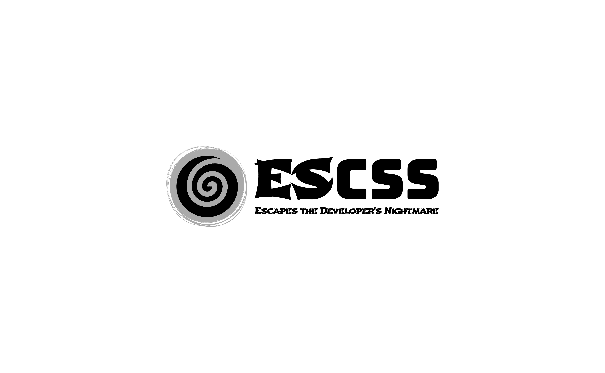

# What is ESCSS?

- ESCSS (Escapes CSS, pronounced "escapes") is a methodology based on BEM.

## Features
  - 😁 Clean and readable HTML makes your day joyful
  - 😵‍💫 No more worries about Bootstrap or CSS specificity
  - 🤝 Seamless harmony between vanilla CSS, SCSS, and Tailwind
  - ❤️ Better devtools experience for CSS
  - 💯 Smaller bundle size (repetition compresses well with gzip)
  - 💪 Makes QA / your job easier

## Status class:

- Use `!important` to override id / class / bootstrap for consistency

```html
<!-- tailwind -->
<p id="🔥CardList__Title" class="bg-black!">Demo</p>
```

or 

```html
<!-- CSS -->
<p id="🔥CardList__Title" class="--active-black">Demo</p>
```

```scss
#🔥CardList__Title {
  background: gray;
}

.--active-black {
  background: black !important;
}
```

## Naming Convention:

- PascalCase: 
  - 🔥CardList (named based on the component, e.g., `CardList.vue`, `CardList.jsx`)

- Only First / Last word is meaningful:
  - 🔥CardList__Title
  - 🔥CardList__X__X__Img
  - 🔥CardList__X__X__Name

- Emojis category (you may have a different preference): 
  - app(🌀)
  - layout component (📁)
  - page component (📃)
  - component (🔥)
  - reuse component (🔗)


## Note
```scss
// Recommended: easy to search / replace
#🔥PersonCard {
  // ...
}

#🔥PersonCard__Img {
  // ...
}
```

```scss
// NOT Recommended: hard to search / replace in SCSS
#🔥PersonCard {
  // ...
  &__Img {
    // ...
  }
}
```